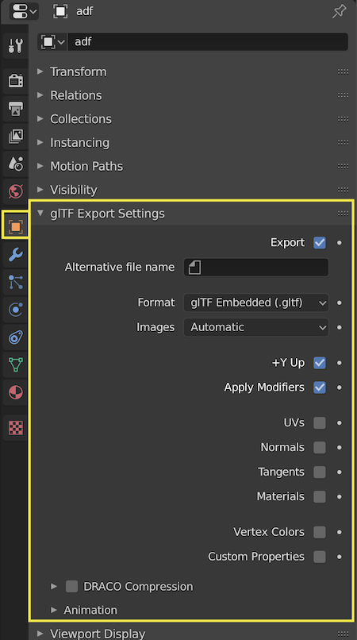
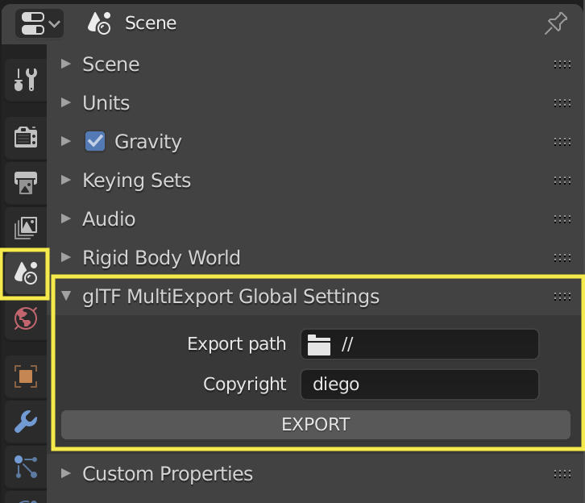
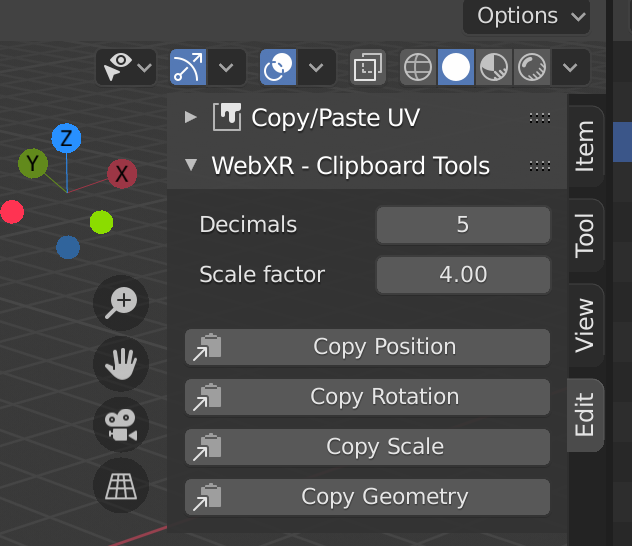

# Blender Add-ons for WebXR

Small Blender Add-ons that may be useful for WebXR and WebGL development

## Installation

1. Download the add-on you like from the webxr-addons folder
2. In Blender, go to Edit > Preferences > Add-ons and click on `Install...`.
3. Select the .py file from your drive, and activate the checkbox next to the newly added Add-on

## glTF MultiExport


Allows to define glTF export settings **per object**, and batch export all objects
in the scene in independent glTF files with a single button (or shortcut).

Global export settings (and export button) are located on the scene properties panel:




## Clipboard tools



Copies to the clipboard the position, rotation or scale of the selected object
```js
// Example output:
1, 4.3, 24
```

It can also copy the **geometry** (vertices and faces) of the selected object.
```js
// Example output:
var Plane = {
  vertices: [-1.56, 0.0, 1.56, 1.56, 0.0, 1.56, -1.56, 0.0, -1.56, 1.56, 0.0, -1.56],
  faces: [0, 1, 3, 2]
}
```


